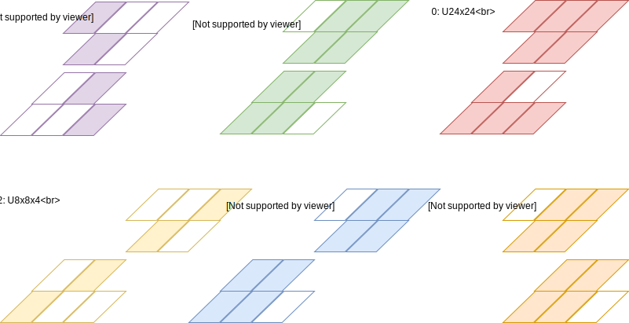

# bfloat16 型に向いている DSP 構成を提案したい

Xilinx と Intel から次世代の FPGA アーキテクチャの発表がありましたが、どちらの DSP も bfloat16 型を効率よく実装できる構造をしていないように思います。  
だからと言ってこんなところで吠えてもしょうがないですが、昔取った… で DSP に望む姿を考えてみようと思います。

少しづつね。

### 機能

0. (符号なし 24bit 整数) × (符号なし 24bit 整数)
1. 予約
2. (符号なし 32bit 整数) × (符号なし 16bit 整数)
3. (符号付き 32bit 整数) × (符号付き 16bit 整数)
4. (符号付き 32bit 整数) × (符号なし 16bit 整数)
5. 予約

### コンパイル

Verilator が必要です。

0. $ make TB=U24x24_tb.cpp
1. 予約
2. $ make TB=U32x16_tb.cpp
3. $ make TB=S32x16_tb.cpp
4. $ make TB=S32xU16_tb.cpp
5. 予約

### 実行

$ ./sim/Vdsp

### 構成

